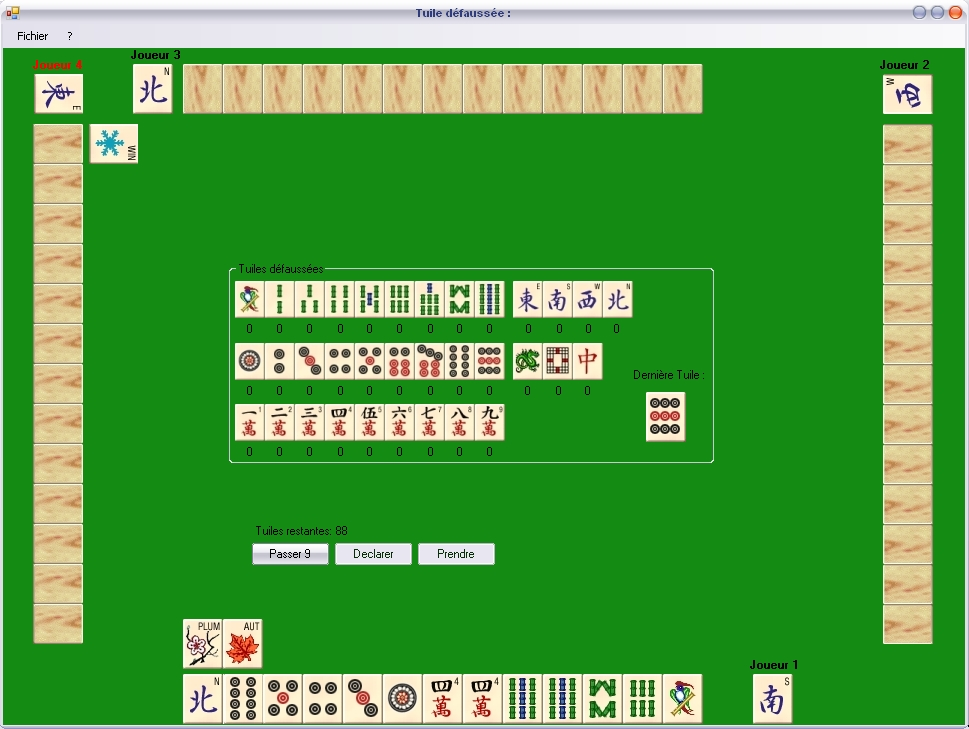

# MahJong Game

Voici un jeu de Mahjong traditionnel.
Le but du jeu est simple, il faut faire des combinaisons avec 14 tuiles et être le premier à le faire.

## Origine de ce code

C'est un vieux code réalisé en 2007 et commité sur Codes-Sources et codé en .net.

#### Repo initial

Jeu de mahjong sur [codes-sources](https://codes-sources.commentcamarche.net/source/43928-jeu-de-mahjong).

#### Source

Je m'étais inspiré du prog java de Tacs (sur [Tacs sur codes-sources](https://codes-sources.commentcamarche.net/source/43524-mahjong-le-vrai)).

## Fonctionnement simple

Les combinaisons gérées dans ce prog sont les pung (3 tuiles), les kong (4 tuiles).

Pour les scores, sont calculés : 
- les pung, 
- les kong, 
- les paires de vent et de dragon. 

Les multiplicateurs appliqués sont : 
- x2 pour les pung et kong de dragon, 
- x2 pung et kong de son vent, 
- x8 jeux purs.

## IA

L'IA reste à améliorer dans une version future, pour l'instant elle défausse les tuiles aléatoirement sauf si elle en a plusieurs du même type.

